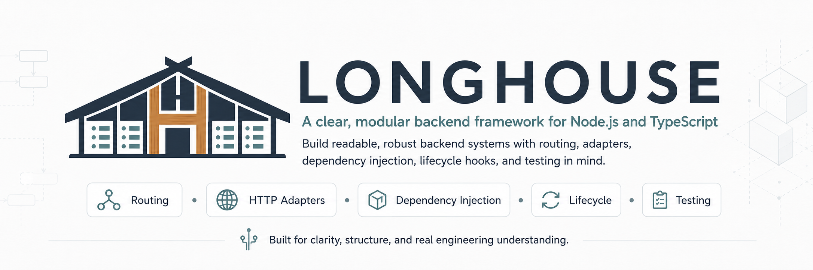

<p align="center">
  
</p>

# Longhouse

> [!IMPORTANT]
> Longhouse is at the earliest stage of development. It does not yet provide an installable framework runtime, a stable public API, or production-ready functionality.

Longhouse is a TypeScript-first, adapter-based backend application framework for Node.js.

It is being built to explore backend framework architecture from the ground up while producing something clear, robust, testable, and genuinely understandable. The project aims to make important framework behaviour visible rather than hiding it behind unexplained conventions or premature abstractions.

Longhouse is inspired by the role occupied by structured backend frameworks, but it is not intended to be a clone of any existing framework.

## Why Longhouse?

Backend frameworks can provide an excellent developer experience, but their internal behaviour can become difficult to follow. Routing, dependency injection, request processing, lifecycle management, metadata, and platform integration may all happen behind layers of convention.

Longhouse takes a different approach:

* build explicit mechanisms before adding convenient syntax;
* keep the execution path traceable;
* introduce abstractions only when they solve demonstrated problems;
* provide useful errors that explain what failed and how to correct it;
* treat tests, documentation, and maintainability as part of the architecture;
* remain approachable without sacrificing engineering discipline.

The goal is not merely to create another web framework. The goal is to understand, design, and document the machinery that makes a backend framework work.

## Core principles

Longhouse follows a small set of engineering principles:

* **Make the path visible.**
* **Prefer clarity over cleverness.**
* **Be explicit where behaviour matters.**
* **Keep the framework core independent of platform-specific details.**
* **Validate data at system boundaries.**
* **Fail helpfully and predictably.**
* **Test behaviour rather than implementation choreography.**
* **Verify the real compiled package, not only the source code.**
* **Introduce abstractions only when they have earned their place.**
* **Build one complete vertical slice at a time.**

Longhouse should be readable by a careful newcomer and still respectable to an experienced engineer.

## Current status

Longhouse is currently in its foundation stage.

### Available now

* the public project repository;
* initial project identity and branding;
* the architectural direction and engineering principles;
* introductory project documentation;
* an MIT licence.

### Not implemented yet

* an application runtime;
* published npm packages;
* HTTP server integration;
* routing;
* middleware;
* request and response abstractions;
* dependency injection;
* modules or controllers;
* lifecycle hooks;
* testing utilities;
* command-line tooling;
* a stable public API.

There is currently nothing to install or use in an application.

## Architecture direction

Longhouse will be built directly on Node.js.

The first platform implementation will use the native `node:http` module:

```text
Node.js
    ↓
node:http
    ↓
Longhouse Node HTTP adapter
    ↓
Longhouse framework core
```

The platform adapter will be responsible for translating between Node.js and framework-level contracts. The framework core will remain independent of Node-specific request and response types.

The core is expected to own responsibilities such as:

* application creation and lifecycle;
* request context;
* routing and handler execution;
* middleware processing;
* framework responses;
* controlled error handling;
* dependency resolution.

Express is not intended to sit underneath the Longhouse core. Optional integrations or additional adapters may be considered later, but the framework must first understand and own its fundamental behaviour.

## First development milestone

The first implementation milestone will establish one complete HTTP request path:

1. create a Longhouse application;
2. start a native Node.js HTTP server;
3. register a static route;
4. match an HTTP method and path;
5. execute the route handler;
6. serialize a JSON response;
7. return a controlled `404` response for unknown routes;
8. return a controlled `500` response for unexpected failures;
9. close the application gracefully;
10. verify the compiled package through the real Node.js runtime.

This deliberately small milestone will establish the foundation before more advanced functionality is introduced.

## Planned direction

Future development may include:

* route parameters, query values, headers, and JSON request bodies;
* a structured middleware and execution pipeline;
* dependency injection with clear resolution errors;
* modules and controllers;
* optional decorator-based APIs built on explicit underlying mechanisms;
* lifecycle hooks;
* framework testing utilities;
* structured logging and configuration;
* health checks and API documentation;
* additional platform adapters where they provide real value.

These are plans, not promises of currently available functionality. Their design may change as the framework develops and evidence emerges.

## Documentation

Longhouse documentation will be added as the framework foundation develops.

Planned documentation includes:

- a public project guide covering architecture and engineering principles;
- a contributor onboarding guide;
- architecture decision records for significant technical choices;
- implementation guides tied to completed framework capabilities.

## Contributing

Longhouse is not yet ready for broad implementation contributions while its initial foundation is being established.

Discussion, questions, and carefully scoped suggestions are welcome through [GitHub Issues](https://github.com/RKALM/longhouse/issues).

Development will follow a disciplined workflow:

```text
Issue
→ acceptance criteria
→ short-lived branch
→ tests and verification
→ coherent commits
→ pull request
→ review
→ merge
```

Meaningful changes should preserve project intent, remain reviewable, and follow the repository’s engineering standards.

## Licence

Longhouse is released under the [MIT Licence](./LICENSE).

---

<p align="center">
  <strong>Obvious where possible. Explicit where important. Helpful when something fails.</strong>
</p>
