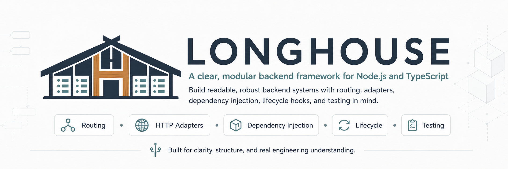

<p align="center">
  
</p>

# Longhouse

> [!IMPORTANT]
> Longhouse is still at an early stage of development. It now has an executable TypeScript and native Node.js HTTP foundation, but it does not yet provide an installable framework package, a stable public API, or production-ready functionality.

Longhouse is a TypeScript-first, adapter-based backend application framework for Node.js.

It is being built to explore backend framework architecture from the ground up while producing something clear, robust, testable, and genuinely understandable. The project aims to make important framework behaviour visible rather than hiding it behind unexplained conventions or premature abstractions.

Longhouse is inspired by the role occupied by structured backend frameworks, but it is not intended to be a clone of any existing framework.

## Why Longhouse?

Backend frameworks can provide an excellent developer experience, but their internal behaviour can become difficult to follow. Routing, dependency injection, request processing, lifecycle management, metadata, and platform integration may all happen behind layers of convention.

Longhouse takes a different approach:

* build explicit mechanisms before adding convenient syntax;
* keep the execution path traceable;
* introduce abstractions only when they solve demonstrated problems;
* provide useful errors that explain what failed and how to correct it;
* treat tests, documentation, and maintainability as part of the architecture;
* remain approachable without sacrificing engineering discipline.

The goal is not merely to create another web framework. The goal is to understand, design, and document the machinery that makes a backend framework work.

## Core principles

Longhouse follows a small set of engineering principles:

* **Make the path visible.**
* **Prefer clarity over cleverness.**
* **Be explicit where behaviour matters.**
* **Keep the framework core independent of platform-specific details.**
* **Validate data at system boundaries.**
* **Fail helpfully and predictably.**
* **Test behaviour rather than implementation choreography.**
* **Verify the real compiled package, not only the source code.**
* **Introduce abstractions only when they have earned their place.**
* **Build one complete vertical slice at a time.**

Longhouse should be readable by a careful newcomer and still respectable to an experienced engineer.

## Current status

Longhouse is currently in its foundation stage.

### Available now

* an executable TypeScript and Node.js project foundation;
* native HTTP server integration using `node:http`;
* Node-specific HTTP behaviour isolated in the platform-specific layer;
* validated `HOST` and `PORT` runtime configuration;
* safe local defaults using `127.0.0.1:3000`;
* optional local `.env` configuration;
* compilation to executable ES module JavaScript;
* TypeScript strict-mode type checking;
* a native Node.js runtime acceptance test against the compiled output;
* project identity, branding, and contributor documentation;
* an MIT licence.

The current HTTP server deliberately returns a temporary `501 Not Implemented` JSON response because framework request handling and routing do not exist yet.

That response exists only to prove the executable HTTP foundation and is not a stable Longhouse public API.

### Not implemented yet

* an installable or published framework package;
* route registration or matching;
* route parameters;
* framework request and response abstractions;
* middleware;
* dependency injection;
* modules or controllers;
* decorators or metadata;
* application lifecycle hooks;
* framework testing utilities;
* command-line tooling;
* a stable public API.

Longhouse can now be built, tested, and run as an executable development foundation, but it is not yet ready to be used as an application framework.

## Development

### Requirements

* Node.js 24 or newer
* npm

### Install

Install the dependencies from the committed lockfile:

```bash
npm ci
```

### Type-check

Check the TypeScript source without emitting build output:

```bash
npm run typecheck
```

### Build

Compile the TypeScript source into executable JavaScript:

```bash
npm run build
```

The compiled output is written to `dist/`.

### Test

Run the current test suite:

```bash
npm test
```

The runtime acceptance test builds Longhouse, creates the compiled native HTTP server, listens on an ephemeral port, performs a real HTTP request, verifies the temporary response, closes the server, and confirms that the test process exits cleanly.

### Run

Build the project first:

```bash
npm run build
```

Then start the compiled server:

```bash
npm start
```

With the default configuration, Longhouse listens on:

```text
http://127.0.0.1:3000
```

Requests currently receive the temporary `501 Not Implemented` response described above.

### Local runtime configuration

Longhouse accepts two environment variables:

* `HOST` — listening host; defaults to `127.0.0.1`;
* `PORT` — listening port; defaults to `3000`.

For local development, copy the example environment file:

```bash
cp .env.example .env
```

The example contains:

```dotenv
HOST=127.0.0.1
PORT=3000
```

The local `.env` file is optional and is excluded from version control. Runtime configuration is validated before the server begins listening.

Environment variables supplied directly by the runtime environment can also be used without a `.env` file.

## Architecture direction

Longhouse is built directly on Node.js.

The first platform implementation uses the native `node:http` module:

```text
Node.js
    ↓
node:http
    ↓
Longhouse Node HTTP adapter
    ↓
Longhouse framework core
```

The platform-specific HTTP layer contains Node.js request and response types so that future framework-core code can remain independent of Node-specific transport details.

Framework-core abstractions will be introduced only when framework behaviour actually requires them.

The core is expected to own responsibilities such as:

* application creation and lifecycle;
* request context;
* routing and handler execution;
* middleware processing;
* framework responses;
* controlled error handling;
* dependency resolution.

Express is not intended to sit underneath the Longhouse core. Optional integrations or additional adapters may be considered later, but the framework must first understand and own its fundamental behaviour.

## First development milestone

The first complete framework milestone will establish one complete HTTP request path:

1. create a Longhouse application;
2. start a native Node.js HTTP server;
3. register a static route;
4. match an HTTP method and path;
5. execute the route handler;
6. serialize a JSON response;
7. return a controlled `404` response for unknown routes;
8. return a controlled `500` response for unexpected failures;
9. close the application gracefully;
10. verify the compiled package through the real Node.js runtime.

The executable TypeScript and native HTTP foundation, including compiled-runtime verification, is now in place. The remaining framework behaviour will be introduced incrementally rather than through speculative abstractions.

## Planned direction

Future development may include:

* route parameters, query values, headers, and JSON request bodies;
* a structured middleware and execution pipeline;
* dependency injection with clear resolution errors;
* modules and controllers;
* optional decorator-based APIs built on explicit underlying mechanisms;
* lifecycle hooks;
* framework testing utilities;
* structured logging and configuration;
* health checks and API documentation;
* additional platform adapters where they provide real value.

These are plans, not promises of currently available functionality. Their design may change as the framework develops and evidence emerges.

## Documentation

Longhouse documentation will continue to grow alongside completed framework capabilities.

Current project documentation includes the contributor guide and repository README.

Planned documentation includes:

- a public project guide covering architecture and engineering principles;
- architecture decision records for significant technical choices;
- implementation guides tied to completed framework capabilities.

## Contributing

Longhouse is still early in development and is not yet seeking broad, unsupervised implementation contributions.

Discussion, questions, and carefully scoped suggestions are welcome through [GitHub Issues](https://github.com/RKALM/longhouse/issues).

Please read [CONTRIBUTING.md](./CONTRIBUTING.md) before proposing or implementing a change.

Development follows a disciplined workflow:

```text
Issue
→ acceptance criteria
→ short-lived branch
→ tests and verification
→ coherent commits
→ pull request
→ review
→ merge
```

Meaningful changes should preserve project intent, remain reviewable, and follow the repository’s engineering standards.

## Licence

Longhouse is released under the [MIT Licence](./LICENSE).

---

<p align="center">
  <strong>Obvious where possible. Explicit where important. Helpful when something fails.</strong>
</p>
